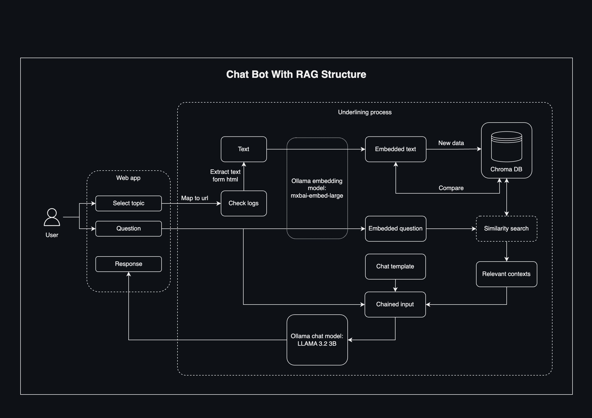

### Legal Document Question Answering Chatbot

This repository contains a Python-based solution for answering legal questions using a collection of legal documents from different categories related to Data aspects, stored in a vector store. The system uses Langchain, Chroma, and Ollama models to process and retrieve answers from legal documents.

## Structure

## Demo

